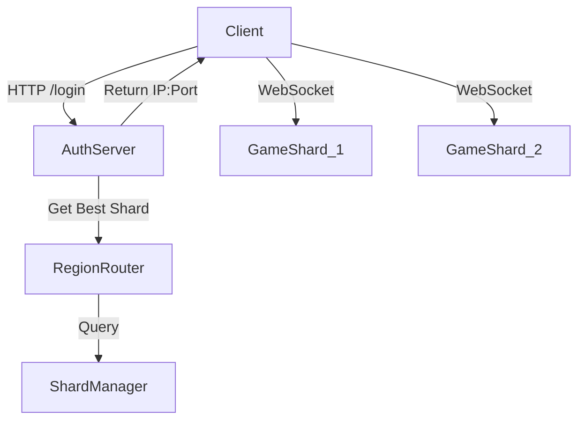

# 🌍 global Sharding Strategy

This document outlines how the MMO scales horizontally to support 2000+ players using a Region-based Sharding architecture.

## 1. Terminology

*   **Region**: A physical geographic location (e.g., `EU-Central`, `US-East`). Latency boundary.
*   **Shard**: A single `Node.js` process running the `GameEngine`. Houses a full copy of the world map.
*   **Zone**: A logical area within the game map (e.g., `Zone 1: Starter Village`).
*   **Router**: The Login/Auth service that directs players to a Shard.

## 2. Architecture

## 3. Scaling Phases

### Phase 1: Single Shard (Current)
*   All players on one Node.js process.
*   Limit: ~500 CCU.

### Phase 2: Multi-Shard (Soft Sharding)
*   Multiple Shards per Region.
*   **Parallel Worlds**: `EU-Shard-1` and `EU-Shard-2` are identical copies of the world.
*   Players are routed to the least populated Shard.
*   Players can "Change Channel" to join friends.
*   **Data**: Player Inventory/Stats are stored in a central DB (Mongo/Postgres), accessible by ALL shards.

### Phase 3: Zone Offloading (Future)
*   If `EU-Shard-1` is overloaded, heavyweight zones (e.g., Dungeons) run on separate Worker Threads.

## 4. Routing Logic (`RegionRouter`)

1.  **Region Filter**: Only consider shards in user's selected Region.
2.  **Health Check**: Ignore offline/maintenance shards.
3.  **Load Balancing**: Select shard with lowest `% Capacity`.
4.  **Sticky Sessions**: If a player was recently on Shard A, try to route back to Shard A (cached in Redis).

## 5. Cross-Shard Communication

Since Shards are isolated processes, they share state via **Redis Pub/Sub**:

*   **Chat**: Global/Guild chat messages are published to Redis and subscribed by all Shards.
*   **Guilds**: Guild status updates sync via DB.
*   **Friend Online Status**: Updated in Redis.

## 6. Deployment

*   Shards register themselves to the `ShardManager` on startup.
*   Shards send heartbeats every 5 seconds.
*   If a heartbeat is missed (30s), Shard is marked `offline`.
